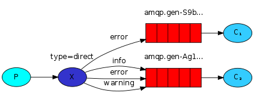

# Exemplos em Java com RabbitMQ

Nesse projeto estão exemplos do tutorial oficial do RabbitMQ

- https://github.com/rabbitmq/rabbitmq-tutorials
- http://www.rabbitmq.com/getstarted.html

## Exemplo 01 - Hello world!

Simples hello world.

## Exemplo 02 - Work queues

Distribuindo tarefas por todos os processos trabalhadores (de forma igualitária - *round robin*).

## Exemplo 03 - Publish / Subscribe

Enviando mensagens para diversos consumidores.

## Exemplo 04 - Routing

Recebendo mensagens de forma seletiva, escolhendo de qual fila receberá mensagens.

## Exemplo 05 - Topics

Recebendo mensagens com base em padrões de texto (tópicos).

## Exemplo 06 - RPC

Estilo pedido/resposta de uma chamada de procedimento remota.

## Instruções para compilação

### Usando Netbeans

1. Abra o projeto no Netbeans e clique sobre "Clean & Build"
2. Pacotes `.jar` resultantes da compilação estarão no subdiretório `target`

### Usando o maven no terminal

1. Entre no diretório do projeto
2. Digite: `mvn package`
3. Pacotes `.jar` resultantes da compilação estarão no subdiretório `target`

## Instruções para execução dos exemplos

> É necessário ter um servidor RabbitMQ em execução na máquina local e com usuário e senha padrão (guest/guest). Veja a [documentação oficial](http://www.rabbitmq.com/download.html) para instalar um servidor e colocá-lo em execução.

Cada exemplo é composto por dois programas, geralmente, um produtor e um consumidor. Abaixo é apresentado como executar cada um dos programas do exemplo 01. Os demais exemplos seguem a mesma lógica de execução, porém com alguns pequenos ajustes. A explicação do funcionamento de cada exemplo pode ser obtida na [documentação oficial do RabbitMQ](http://www.rabbitmq.com/getstarted.html)

#### Exemplo 01

1. Executando o produtor de mensagens

   `java -jar rabbitMQExemplos-ex01-produtor.jar`

2. Executando o consumidor de mensagens

   `java -jar rabbitMQExemplos-ex01-consumidor.jar`

